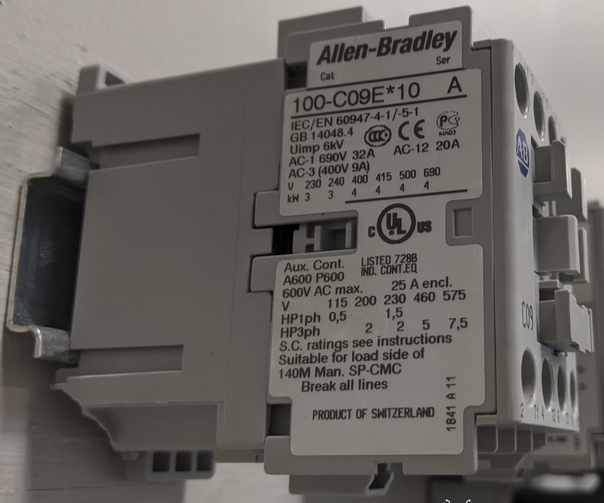

# MOTOR WIRING ALT MOTOR STARTER

Complete the following tasks:
- Properly wire the 3-phase induction MOTOR for LOW VOLTAGE 
- Properly wire the MOTOR to the VARIABLE FREQUENCY DRIVE output (T1, T2, T3) 
- Properly wire the MAIN POWER DISCONNECT to the VARIABLE FREQUENCY DRIVE input (L1, L2, L3) 
- Properly wire the TRANSFORMER input (H1-H4) to the MAIN POWER DISCONNECT output (L1, L2) 
- Properly wire the AB 100-C09*10A CONTACTOR (small, gray, 3-phase relay) 

*NO and NC numbering may vary between models

**Troubleshoot as needed

Note:
- See Sketch #12 for details.

## Alternate Motor Starter Contactor

