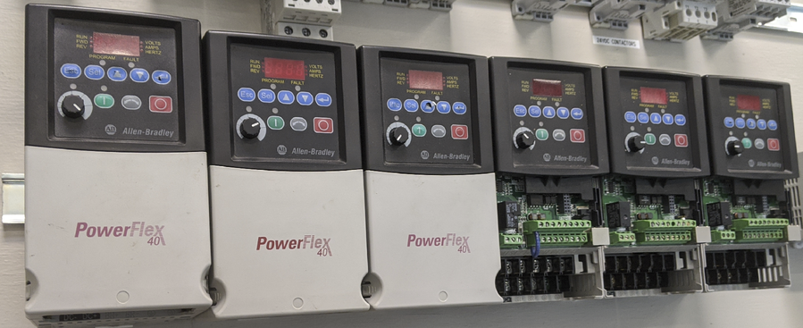

# MOTOR WIRING VFD

## Complete the following installation tasks:
- Properly wire the 3-phase induction MOTOR for LOW VOLTAGE 
- Properly wire the MOTOR to the VARIABLE FREQUENCY DRIVE output (T1, T2, T3) 
- Properly wire the MAIN POWER DISCONNECT to the VARIABLE FREQUENCY DRIVE input (L1, L2, L3) 
- Properly wire the TRANSFORMER input (H1-H4) to the MAIN POWER DISCONNECT output (L1, L2) 
- Properly wire the AB 100-C09*10A CONTACTOR (small, gray, 3-phase relay) 

## Complete the following operation tasks:
- Reset any previous configurations or parameters, as needed. 
- Operate the Start/Stop from the VFD local control buttons 
- Change the speed (frequency) using the VFD control knob 
- Meter the output voltages across T1, T2, T3. 
- Explain any deviations that may be present. 

*NO and NC numbering may vary between models

**Troubleshoot as needed

Note:
- See Sketch #13 for details.

## Variable Frequency Drives (VFD)

