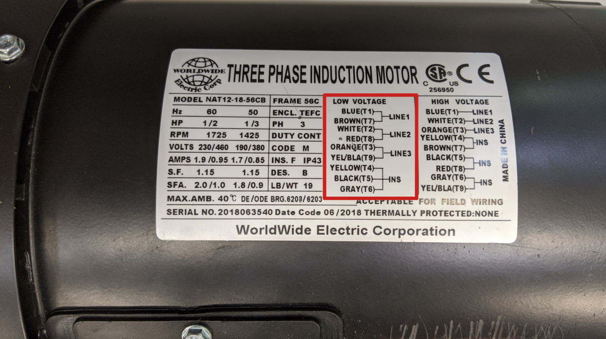

# BASE MOTOR WIRING

Complete the following tasks:
- Properly wire the 3-phase induction MOTOR for LOW VOLTAGE 
- Properly wire the MOTOR to the MOTOR STARTER output (T1, T2, T3) 
- Properly wire the MOTOR STARTER COIL to an N.O. START and N.C. STOP PUSH-BUTTON 
- Properly wire the PUSH-BUTTONS to the AUXILIARY CONTACTS (*2-| |-3) and the TRANSFORMER outputs (X1-X2) 
- Properly wire the MOTOR STARTER input (L1, L2, L3) to the MAIN POWER DISCONNECT output (L1, L2, L3) 
- Properly wire the TRANSFORMER input (H1-H4) to the MAIN POWER DISCONNECT output (L1, L2) 
- Properly install the FUSES into the MAIN POWER DISCONNECT box 

**NO and NC numbering may vary between models

*Troubleshoot as needed

NOTE:
Review Sketch #5 to understand the components.

## Motor Data Plate

