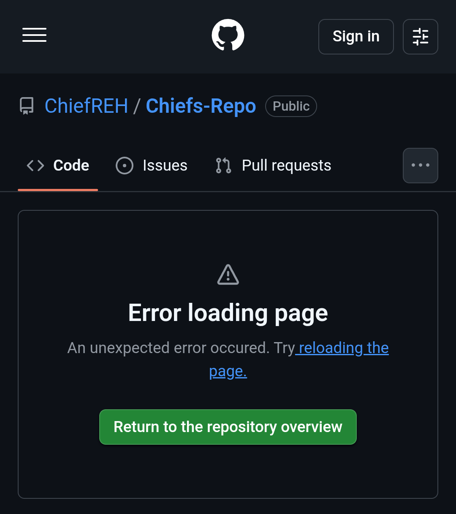
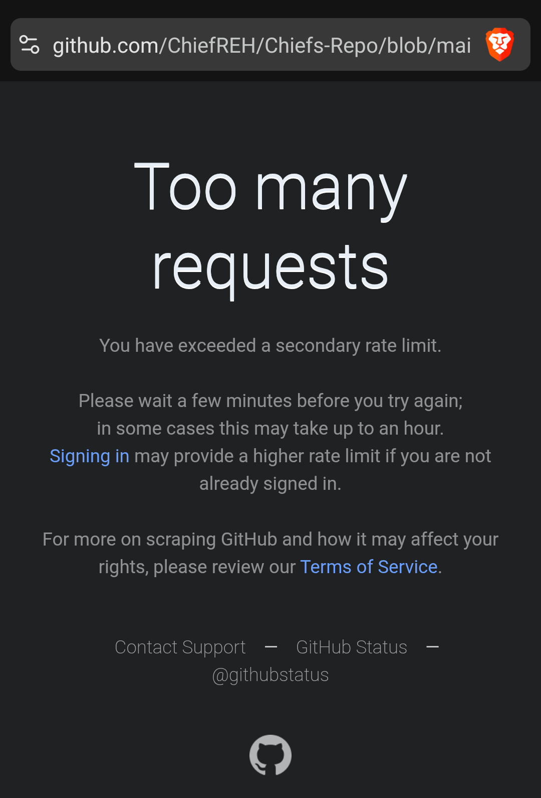

# CHIEF'S REPO

## Repository Purpose

This repository serves as cloud storage for my personal notes, sketches, experiments, and technical logs.

The material contained here documents procedures, configurations, and observations from my own equipment and environment. It is provided primarily for reference and educational purposes.

---

## Safety Notice

* This material is **not a substitute for in-person training** with a qualified instructor.
* Procedures described here may involve **electrical, mechanical, hydraulic, or other potentially hazardous systems**.
* The techniques documented are intended for **my equipment and operating environment only**.
* Anyone choosing to replicate or adapt this information **does so at their own risk**.
* The author assumes **no responsibility or liability** for damage, injury, or loss resulting from the use or misuse of this material.

---

## Issues With Viewing The Repository

Sometimes, GitHub will limit your access to a file.

 If you have issues with viewing the files via your web browser, try the following:

### Online
- Sign up for a free GitHub account to reduce the chances of a "secondary rate limit"
    - Follow for future repo updates ...

### Offline
- Download the entire repo code as a .zip and extract or decompress
    - Use a Markdown editor like [Obsidian](https://obsidian.md) or [Joplin](https://joplinapp.org/) to view the files
    - _My personal preference is [Obsidian](https://obsidian.md)_

---

## Copyright

© 2026 ChiefREH. All rights reserved.

All original content in this repository, including text, diagrams, code examples, and documentation, is the intellectual property of ChiefREH unless otherwise noted.

You may reference, copy, and redistribute this material for educational or informational purposes **provided that proper attribution is given to ChiefREH as the original author**.

---

## Third-Party Copyright and Trademarks

Some names, logos, products, standards, or materials referenced in this repository may be the property of their respective owners.

All trademarks and copyrighted materials belong to their respective holders and are used here for identification or educational purposes only. Their appearance in this repository **does not imply consent, endorsement, or affiliation with the original author**.
