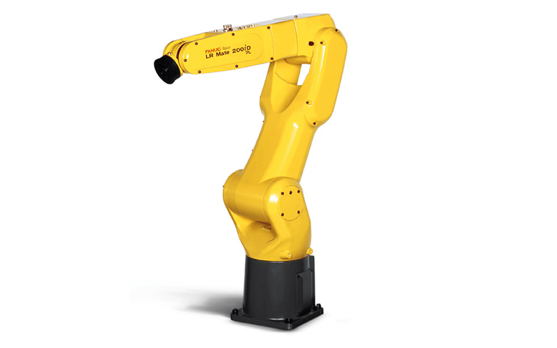
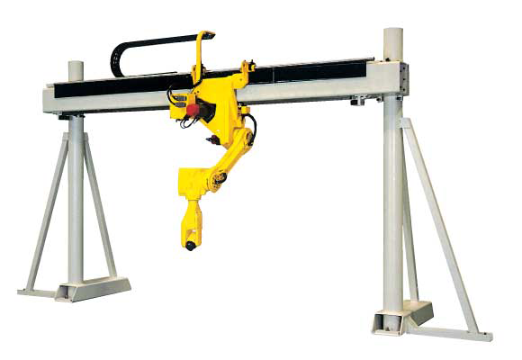
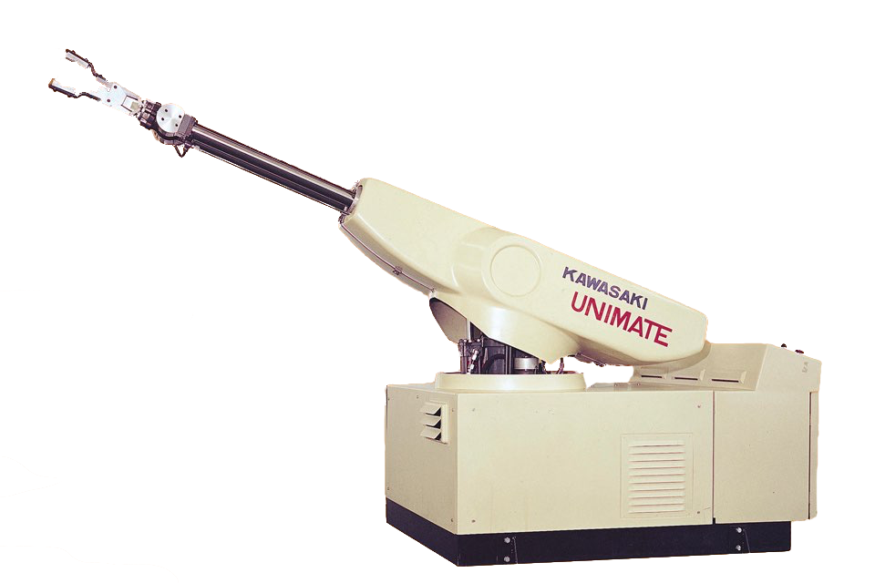

# DISTINGUISH BETWEEN ROBOTIC TYPES

What Constitutes an Industrial Robot?

> An industrial robot is a programmable, automated machine used in manufacturing or production environments to perform tasks such as welding, painting, assembly, pick-and-place, packaging, and more.

According to ISO 8373, an industrial robot is:

> "An automatically controlled, reprogrammable, multipurpose manipulator programmable in three or more axes, which may be either fixed in place or mobile for use in industrial automation applications."

Core Features:
- Programmable: Can perform different tasks by changing instructions.
- Multipurpose: Not limited to a single function.
- Reprogrammable: Adaptable for different jobs.
- Multiple Axes: Usually 3 or more degrees of freedom.
- Autonomous Operation: Can operate without continuous human intervention.

# Types of Industrial Robots

Industrial robots are categorized mainly by their mechanical configuration (kinematics), which determines their movement capabilities, payload, and work envelope.

1. Articulated Robots
    - Structure: Rotary joints (like a human arm); typically 4–6 axes.
    - Movement: Highly flexible; large workspace.
    - Applications: Welding, material handling, painting, assembly.
    - Pros: Versatile, wide range of motion.
    - Cons: More complex, requires more space.
    - Example: FANUC M-20iA, ABB IRB 2600

2. SCARA Robots (Selective Compliance Articulated Robot Arm)
    - Structure: 4 axes; rigid in vertical, flexible in horizontal.
    - Movement: Ideal for planar assembly and pick-and-place.
    - Applications: Assembly, packaging, precision insertion tasks.
    - Pros: Fast, precise, compact.
    - Cons: Limited vertical reach and movement.
    - Example: Epson G-Series, Yamaha YK Series

3. Cartesian Robots (Gantry Robots)
    - Structure: Linear axes (X, Y, Z); operates on rectangular coordinates.
    - Movement: Straight-line motions in three dimensions.
    - Applications: CNC machining, 3D printing, pick-and-place.
    - Pros: Simple design, easy programming, high precision.
    - Cons: Bulky, requires large space.
    - Example: IAI RoboCylinder, custom-built gantry systems

4. Delta Robots (Parallel Robots)
    - Structure: Three arms connected to a common base; typically 3-4 axes.
    - Movement: High-speed, small payload, dome-shaped workspace.
    - Applications: Fast pick-and-place, packaging, sorting.
    - Pros: Ultra-fast, lightweight.
    - Cons: Limited payload and workspace.
    - Example: ABB FlexPicker IRB 360

5. Cylindrical Robots
    - Structure: Rotary base with linear motion along the arm; combines rotary and linear joints.
    - Movement: Cylindrical workspace.
    - Applications: Machine loading/unloading, die casting.
    - Pros: Simple for vertical operations.
    - Cons: Less versatile than articulated robots.
    - Example: Older industrial robots; less common today

6. Polar Robots (Spherical Robots)
    - Structure: Revolute joints and one linear joint; base rotates, arm moves in a spherical range.
    - Movement: Spherical work envelope.
    - Applications: Welding, handling heavy materials.
    - Pros: Large reach with fewer joints.
    - Cons: Less precise, harder to program.
    - Example: Older generation robots; rarely used in modern setups

7. Collaborative Robots (Cobots)
    - Structure: Typically articulated, but designed for direct human interaction.
    - Key Feature: Built-in safety features like force limiting, vision systems.
    - Applications: Light assembly, machine tending, inspection.
    - Pros: Safe for humans, easy to deploy.
    - Cons: Lower speed and payload compared to traditional robots.
    - Example: Universal Robots UR5e, FANUC CRX series

