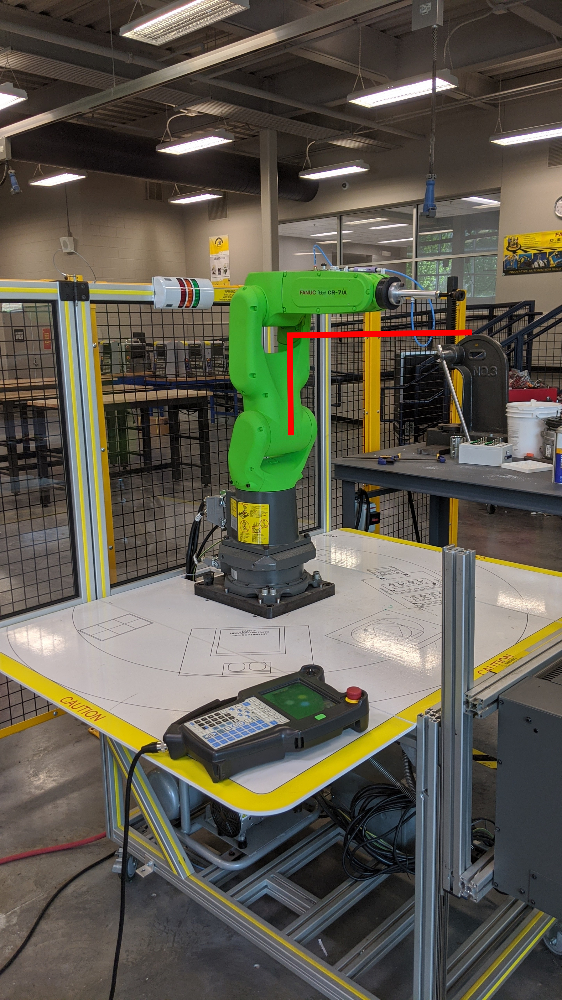
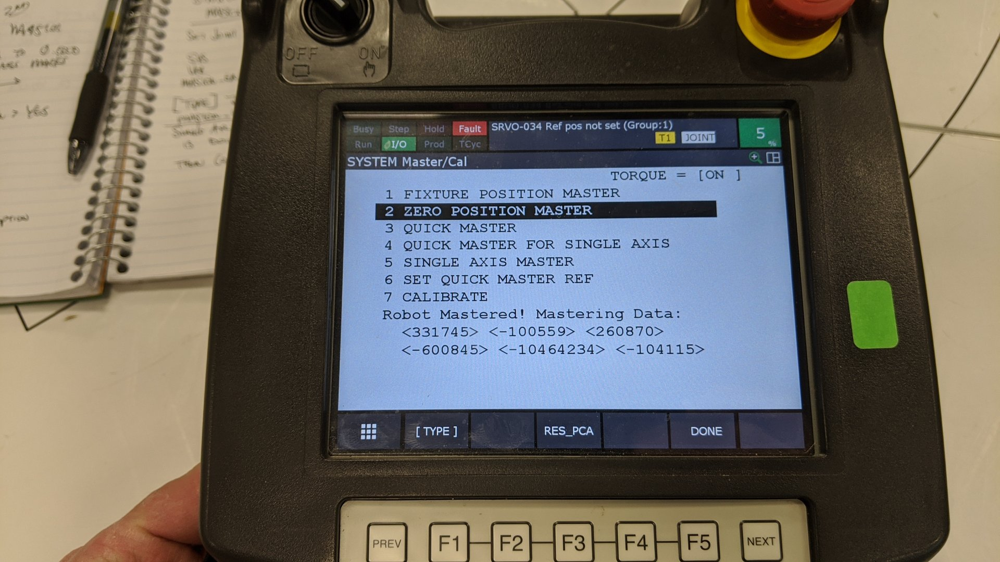
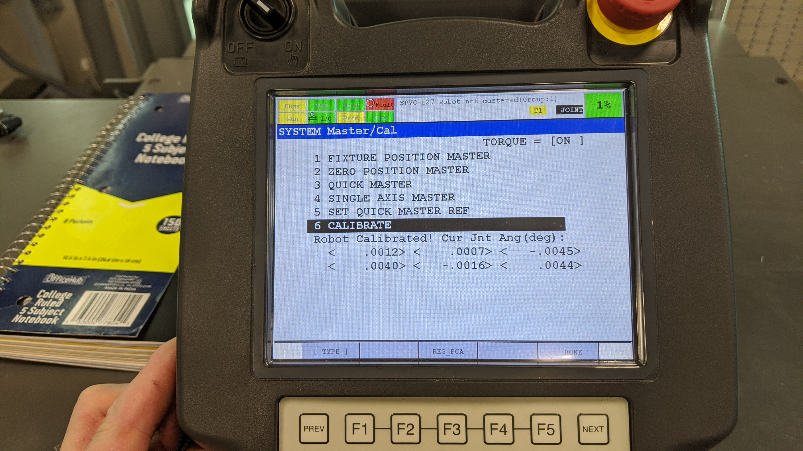
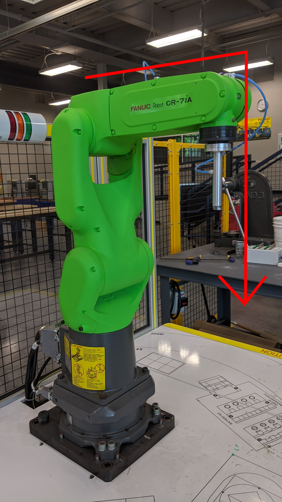

# FANUC ROBOT MASTER/CAL

## SRVO-062 BZAL ALARM
Batteries are dead or you changed batteries with the robot turned off, losing all position data.

## 1. Change the batteries
- Recommended to change while the controller is powered on, to prevent losing Master Calibration data.

## 2. Jog all the joints to their zero positions (“Witness Marks”)
- Ensure that the flange (J6) or EOAT are pointed away from the base and not pointed straight down toward the work area.  This should help prevent a singularity later on.

## 3. Enable the Mastering/Calibration Menu:
- Menu > System > Variables > scroll down to "$MASTER_ENB = 0"
- Set "$MASTER_ENB = 0" to "$MASTER_ENB = 1" and press ENTER
- Then go back to > Menu > System > Master/Cal
- Verify that all 6 axis to their mechanical 0 positions ("witness marks") 
- Verify J6 flange/EOAT is horizontal, pointing away from the base

## 4. Select ZERO POSITION MASTER > Enter > [F4] > YES/OK
- Screen should display all new $MASTER_COUNT values
- Record these numbers for future reference.

## 5. Scroll down to CALIBRATE > Enter > [F4] > YES/OK
- The screen should show all zeros (more or less) at the bottom
- If you don't calibrate, you will be able to jog but NOT save any programming points in the Teach Pendant program editor (_numbered Points appear as red text in a yellow box_)

# ADDITIONAL PARAMETERS

- If needed, reset the Pulse Coder first > from the MASTER/CAL screen > [RES_PCA] > then [FCTN] > [RESTART / HOT START].  If there is no Master/Cal menu option, see Step #3 above
If you get a "No Pulse Established" alarm after the Hot Start, jog all the joints off their current position +/-20-deg to send new pulses.

- If APPLY DCS PARAM alarm is active, go to > MENU > SYSTEM > DCS > [APPLY] > enter code > [OK] > [FCTN] > cycle power [HOT START] or cycle the controller power OFF and ON.

- You must manually cycle the Main Power Switch on the front of the Controller when the screen tells you to do so.  Wait 15-20 seconds for the capacitors to discharge before starting everything back up.  After reboot, check for alarms. Should be good to go!

- Before any programming takes place, jog/rotate the J5 axis to -90 degrees (pointing straight down at the work area).  This will reduce the chances of a SINGULARITY during operation.  Also a good idea to store this new position in the POSITION REGISTER.

- You can disable the ETH/IP alarm from > Menu > I/O menu > last menu on the far right (right arrow 2 times) > EtherNet/IP > ENTER > the first entry is TRUE > change to FALSE.

- Alarm MCTL-013 can be disabled from > Menu > System > Variable > $OP_WORK > ENTER > set UOP Disable = 1 (TRUE) > ENTER.

- If your robot speed will not go beyond 50% during its run: MENU > SYSTEM > VARIABLES > $SCR > change RUNOVLIM = 100.

- JOGOVLIM will override the manual jog speed, potentially preventing a crash!

